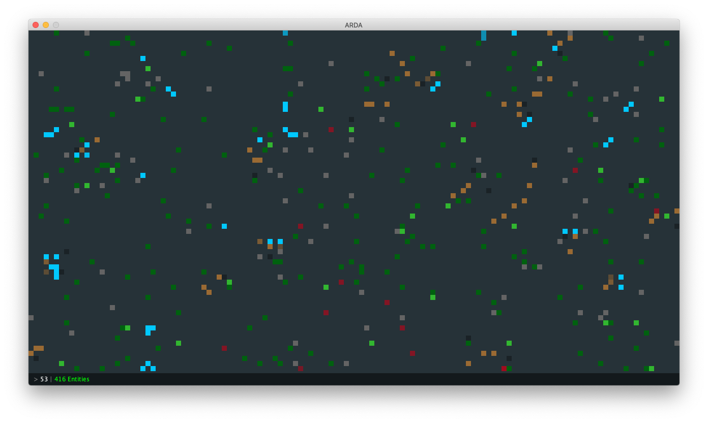

# ARDA (Autonomous Rabbits Dream of ARDA)

A Middle-earth-simulating cellular automaton.



## Getting Things Running

### Terminal Execution

While in *this* directory, next to `src/`, compile the source via makefile:

```bash
make
```

Then, execute the compiled program:

```bash
make run
```

### Unit Testing

To set up testing via Eclipse, follow the steps below. Please note that the tests assume that all values in `config/silmarillion.cfg` are left at their published defaults, and will therefore almost certainly fail if the configuration is altered.

1. In Eclipse, create a new Java Project
2. Give it a nice, memorable, Tolkien-esque name, then click <kbd>Finish</kbd>
3. In the dialog offering to create modules, click <kbd>Don't Create</kbd>
4. Right-click the new project and select <kbd>Import...</kbd>
5. In the dialog, choose *General > File System* and click <kbd>Next</kbd>
6. Browse to THIS folder as the source and click <kbd>Open</kbd>
7. Click <kbd>Select All</kbd>, then <kbd>Finish</kbd>
8. In the Eclipse Package Explorer, open any test in `src/` (e.g. `test.arda.entity/EntityTest.java`)
9. Hover over the red-underlined `org.junit` import
10. Choose the option *Fix project setup*
11. In the dialog offering to add JUnit to the build path, select the JUnit option and click <kbd>OK</kbd>
12. Run tests (any `test.arda` path) and profit


## Design Discussion

The simulation is an interaction between **Entities**, who can hold **Items**, and move about a **World**.

If we think of the **World** as a game board, then **Entities** are the pieces on that board. These pieces can be either **Creatures** or **Shrubbery** (**Bushes** and **Stones**). There are also **Items**, but unlike **Entity** pieces, **Items** do not exist physically on the board, instead existing virtually in the **Inventories** of **Entities**. Because **Items** cannot exist in the physical **World**, there is no mechanic by which **Items** are “dropped”. Instead, **Items** simply pass from one **Entity**’s **Inventory** to another’s. Whether the receiving **Entity** can utilize a given **Item** is not guaranteed.

An **Entity** might be a **Hobbit**. A **Hobbit**, through **Entity**, has an **Inventory**. Inside that **Inventory** might be **Apples**, **Meat**, or even a **Ring** or some **Mithril** armor. **Apples** and **Meat**, being food items, restore health upon consumption by the **Hobbit**. The **Mithril** buffs defense. The **Ring** increases the detection range of the **Hobbit**, at the cost of reduced maximum health. **Hobbits** lose nourishment with each tick of the **World**, and need to eat food **Items** whenever they get hungry enough or else risk starving to death. Looting **Bushes** and slain **Rabbits** gives the **Hobbits** food to sustain themselves. **Hobbits** can teleport from one edge of the **World** to the opposite edge as if by "tunneling" or passing through a shadow realm, as it were. To complicate their existence, **Hobbits** are the prey of **Nazgul** and therefore prioritize running away from them above all other actions. **Hobbits** cannot attack **Nazgul**, nor would they loot them.

**Nazgul** attack **Hobbits**, the act of which replenishes their health. They can replicate and roam around, but need to attack **Hobbits** in order to avoid starving to death.

**Rabbits** move randomly and reproduce. Inside **Rabbit**’s **Inventory** might be some **Meat**. When the **Rabbit** is slain by a **Hobbit**, the **Meat** passes from the **Rabbit**’s **Inventory** to the **Hobbit**’s. **Rabbits** are not attacked by any other **Creature**.

**Ents** move randomly and at random intervals. They are able to move multiple spaces at a time due to their significant height. Occasionally, each **Ent** will spawn a **Bush** near its position, repopulating the **World** with **Shrubbery**.

Finally, **Shrubbery Entities** like **Bush** or **Stone** do not move, but still have **Inventories**. Inside the **Inventory** of a **Bush** might be an **Apple**. Inside the **Inventory** of a **Stone** might be a random powerful **Item**, such as the aforementioned **Mithril** armor. By interacting with these objects, **Creatures** can obtain loot to aid them in their quests. **Bushes**, particularly, decay over time and eventually die out. This, in combination with **Ent**-based **Bush** spawning, keeps the **World** comfortably vegetated.

### App

* The entry point to the application and home to the `main()` method, this class kicks off the program by calling the `Render` class.

### Render

* Handles the drawing of the visual simulation, ticking the **World** with each step of its `Timer`.
* Color of cells on the board signify the type of each **Entity**.

    * **Hobbits** are blue.
    * **Nazgul** are red.
    * **Rabbits** are brown.
    * **Ents** are bright green.
    * **Stones** are gray.
    * **Bushes** are dark green.

### World

* Keeps track of all **Entities** on the board.
* Randomly seeds the board at the beginning of the simulation.
* Removes dead **Entities** from the board after they have decayed.

### Entity

* Has a **Coordinate**, placing it in the **World**, as well as an **Inventory** to hold **Items**.

### Creature

* Is an **Entity** and handles many standard operational decisions common to all **Creature** sub-types.

*Originally written in Spring 2020*
